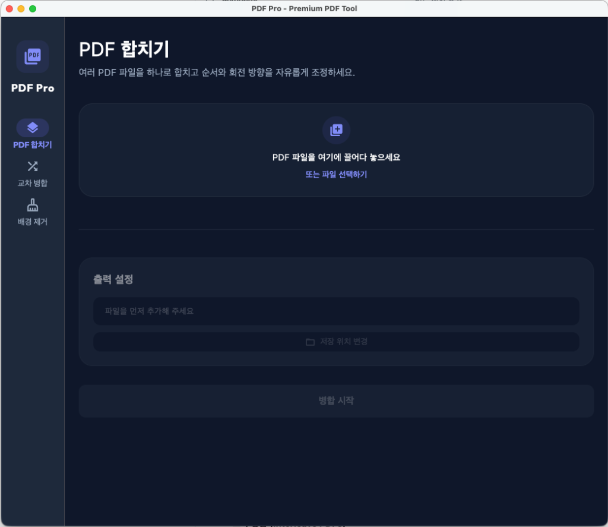

# PdfToPrint (PDF Multi-Tool)



Flutter로 개발된 강력하고 세련된 데스크톱 PDF 유틸리티 애플리케이션입니다. 직관적인 드래그 앤 드롭 인터페이스를 통해 복잡한 PDF 편집 작업을 쉽게 수행할 수 있습니다.

## ✨ 주요 기능

*   **배경 제거 (Background Removal)**
    *   스캔된 PDF나 배경이 어두운 문서의 배경을 제거하여 깔끔하고 인쇄에 적합한 상태로 만듭니다.
    *   화이트 포인트와 블랙 포인트 슬라이더를 통해 실시간으로 명암 대비를 조절할 수 있습니다.
    *   다중 페이지 PDF에 대해 멀티코어(Isolate) 병렬 처리를 지원하여 매우 빠른 처리 속도를 자랑합니다.

*   **PDF 합치기 (Merge PDFs)**
    *   여러 개의 PDF 파일을 하나의 파일로 순서대로 병합합니다.
    *   각 파일별로 **역순(Reverse)** 옵션과 **페이지 회전(0°, 90°, 180°, 270°)** 옵션을 자유롭게 적용할 수 있습니다.

*   **교차 병합 (Interleave PDFs)**
    *   두 개의 문서(예: 홀수 페이지 문서와 짝수 페이지 문서)를 한 장씩 교차하여 하나의 문서로 병합합니다. (스캔 문서 복원 시 유용)
    *   **배치 처리(Batch Processing)**를 지원하여 여러 세트를 한 번에 추가하고 동시에 처리할 수 있습니다.
    *   각 세트의 파일(A/B)별로 독립적인 **역순** 및 **페이지 회전** 옵션을 지정할 수 있습니다.

*   **백그라운드 스레드 (Isolate) 처리**
    *   모든 무거운 PDF 변환, 렌더링 및 병합 작업은 비동기 백그라운드 스레드에서 처리되어 작업 중에도 UI가 매끄럽게 동작합니다.

## 🚀 설치 및 실행 방법

1.  **릴리즈 다운로드**: GitHub의 [Releases](../../releases) 페이지에서 최신 `PdfToPrint_Installer.dmg` 파일을 다운로드합니다.
2.  **설치**: 다운로드한 `.dmg` 파일을 더블클릭하여 마운트한 후, `PdfToPrint` 앱 아이콘을 `Applications(응용 프로그램)` 폴더로 드래그합니다.
3.  **실행**: Launchpad 또는 응용 프로그램 폴더에서 `PdfToPrint`를 실행합니다.

## 🛠 빌드 방법 (개발자용)

Flutter SDK가 설치된 macOS 환경에서 직접 빌드할 수 있습니다.

```bash
# 디펜던시 설치
flutter pub get

# macOS 앱 릴리즈 빌드
flutter build macos --release
```

## 📝 라이선스

이 프로젝트의 소스 코드는 자유롭게 사용 및 수정하실 수 있습니다.
